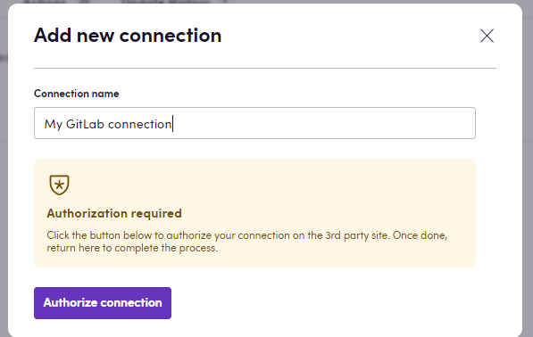

# Blackbird.io GitLab

Blackbird is the new automation backbone for the language technology industry. Blackbird provides enterprise-scale automation and orchestration with a simple no-code/low-code platform. Blackbird enables ambitious organizations to identify, vet and automate as many processes as possible. Not just localization workflows, but any business and IT process. This repository represents an application that is deployable on Blackbird and usable inside the workflow editor.

## Introduction

<!-- begin docs -->

GitLab, is a developer platform that allows developers to create, store, and manage their code. This GitLab app focusses on connecting GitLab events and file actions into the Blackbird ecosystem.

## Before setting up

Before you can connect you need to make sure that:

- You have a GitLab account.
- You have owner permissions on the repository you want to automate on.

## Connecting

1. Navigate to apps and search for GitLab. If you cannot find GitLab then click _Add App_ in the top right corner, select GitLab and add the app to your Blackbird environment.
2. Click _Add Connection_.
3. Name your connection for future reference e.g. 'My GitLab connection'.
4. Click _Authorize connection_.
5. Follow the instructions that GitLab gives you, authorizing Blackbird.io to act on your behalf.
6. When you return to Blackbird, confirm that the connection has appeared and the status is _Connected_.

## Actions

### Repositories

- **List repositories**
- **Create new repository**
- **Get repository**
- **Get repository issues**
- **List repository folder content**

### Branches

- **List branches**
- **Get branch**

### Commits

- **List commits**
- **Get commit**

### Merge requests

- **Create merge request**
- **List merge requests**
- **Get merge request**
- **Get repository merge requests**
- **Complete merge request**

### Files

- **Get repository file**
- **Get all files in folder**
- **Get files by filepaths**
- **Delete file**
- **Push file**
- **Update file**

### Users

- **Get my user data**
- **Get user**
- **Get user by username**

### Utility

- **Is file in folder**

## Events

### Pulls

= **On pull request action** occurs when there is activity on a pull request. See [this page](https://docs.GitLab.com/en/webhooks/webhook-events-and-payloads#pull_request) for more info.

### Pushes

- **On commit pushed** occurs when there is a push to a repository branch. This includes when a commit is pushed, when a commit tag is pushed, when a branch is deleted, when a tag is deleted, or when a repository is created from a template.
- **On files added** is triggered when new commits have new files. It returns the paths to all added files.
- **On files modified** is triggered when new commits modify files. It returns paths to all modified files.
- **On files added or modified** is triggered when new commits add new files or modify files. It returns paths to all these files.
- **On files removed** is triggered when new commits remove files. It returns paths to all deleted files.

For the file specific events, a path parameter can be specified in order to narrow down the event to only files in specific folders or files that have certain extensions. Use the forward slash '/' to represent directory separator. Use '\*' to represent wildcards in file and directory names. Use '\*\*' to represent arbitrary directory depth.

For example: when you want to create an event that triggers only when .html files are modified in a folder called _locales_. Then the path of the **On files added or modified** event should be: _/locales/\*.html_

## Example

The following bird creates a new memoQ project whenever files are updated or added to a specific folder in a GitLab repository.

## Feedback

Do you want to use this app or do you have feedback on our implementation? Reach out to us using the [established channels](https://www.blackbird.io/) or create an issue.

<!-- end docs -->
